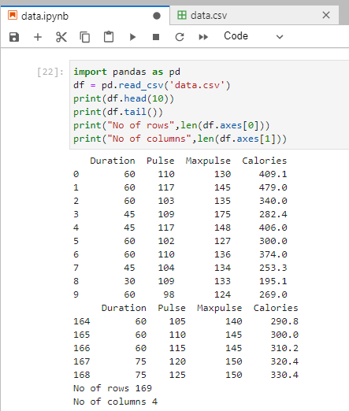

# Read-from-CSV

## AIM:

## ALGORITHM:
### Step 1:
Start the python.

### Step 2:
Import pandas.

### Step 3:
Mention the CSV file which is to be read.

### Step 4:
Read the contents of the CSV file using df.read function

### Step 5:
End the program.

## PROGRAM:
```
developed by:Jeeva Abishake
roll no. :212221240018

import pandas as pd
df = pd.read_csv('data.csv')
print(df.head(10))
print(df.tail())
print("No of rows",len(df.axes[0]))
print("No of columns",len(df.axes[1]))
```

## OUTPUT:


## RESULT:
A python program to read data from CSV files has been created successfully.